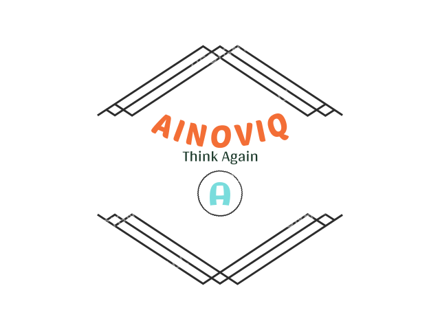

<div align="center">
  
</div>

# Introduction

This repo is a fusion of 'Parser-Free Virtual Try-on via Distilling Appearance Flows(PFAFN)' and 'Regional Mask Guided Network(RMGN)'.

# References
[[Paper]](https://openaccess.thecvf.com/content/CVPR2021/papers/Ge_Parser-Free_Virtual_Try-On_via_Distilling_Appearance_Flows_CVPR_2021_paper.pdf)       [[Supplementary Material]](https://github.com/geyuying/PF-AFN/blob/main/PFAFN_supp.pdf)

[[Checkpoints for Test]](https://drive.google.com/file/d/1_a0AiN8Y_d_9TNDhHIcRlERz3zptyYWV/view?usp=sharing)

[[Training_Data]](https://drive.google.com/file/d/1Uc0DTTkSfCPXDhd4CMx2TQlzlC6bDolK/view?usp=sharing)
[[Test_Data]](https://drive.google.com/file/d/1Y7uV0gomwWyxCvvH8TIbY7D9cTAUy6om/view?usp=sharing)

[[VGG_Model]](https://drive.google.com/file/d/1Mw24L52FfOT9xXm3I1GL8btn7vttsHd9/view?usp=sharing)

## Python Environment Setup

#### Conda environment
```bash
conda create -n pfafn python=3.8
conda activate pfafn
```
#### Dependencies

```bash
conda install pytorch==1.12.0 torchvision==0.13.0 cudatoolkit=11.3 -c pytorch

pip install opencv-python tensorboardX cupy-cuda113
```
#### Device/s
We train our model on a single **`Nvidia RTX A6000 48GB GPU`**

## Dataset

We have create our own dataset by scraping images of cloth and it's corresponding model from various apparel brand websites. We make the dataset as same structure as viton with the shape of `384x512`.

### Structure

**Train dataset structure**
```bash
└── Polo_traindata
    ├── train_color
      ├── ___.jpg
    ├── train_densepose
      ├── ___.npy
    ├── train_edge
      ├── ___.jpg
    ├── train_img
      ├── ___.jpg
    ├── train_label
      ├── ___.png
    └── train_pose
      ├── ____keypoints.json
```

**Test dataset structure**
```bash
└── Polo_testdata
    ├── test_clothes
      ├── ___.jpg
    ├── test_edge
      ├── ___.jpg
    └── test_img
      ├── ___.jpg
```

## Training on Our dataset 
1. cd PF-AFN_train
2. Download the VITON training set from [VITON_train](https://drive.google.com/file/d/1Uc0DTTkSfCPXDhd4CMx2TQlzlC6bDolK/view?usp=sharing) and put the folder "VITON_traindata" under the folder "dataset".
3. Dowload the VGG_19 model from [VGG_Model](https://drive.google.com/file/d/1Mw24L52FfOT9xXm3I1GL8btn7vttsHd9/view?usp=sharing) and put "vgg19-dcbb9e9d.pth" under the folder "models".
4. First train the parser-based network PBAFN. Run **scripts/train_PBAFN_stage1.sh**. After the parser-based warping module is trained, run **scripts/train_PBAFN_e2e.sh**.
5. After training the parser-based network PBAFN, train the parser-free network PFAFN. Run **scripts/train_PFAFN_stage1.sh**. After the parser-free warping module is trained, run **scripts/train_PFAFN_e2e.sh**.
6. Following the above insructions with the provided training code, the [[trained PF-AFN]](https://drive.google.com/file/d/1Pz2kA65N4Ih9w6NFYBDmdtVdB-nrrdc3/view?usp=sharing) achieves FID 9.92 on VITON test set with the test_pairs.txt (You can find it in https://github.com/minar09/cp-vton-plus/blob/master/data/test_pairs.txt).

## Run the demo
1. cd PF-AFN_test
2. First, you need to download the checkpoints from [checkpoints](https://drive.google.com/file/d/1_a0AiN8Y_d_9TNDhHIcRlERz3zptyYWV/view?usp=sharing) and put the folder "PFAFN" under the folder "checkpoints". The folder "checkpoints/PFAFN" shold contain "warp_model_final.pth" and "gen_model_final.pth". 
3. The "dataset" folder contains the demo images for test, where the "test_img" folder contains the person images, the "test_clothes" folder contains the clothes images, and the "test_edge" folder contains edges extracted from the clothes images with the built-in function in python (We saved the extracted edges from the clothes images for convenience). 'demo.txt' records the test pairs. 
4. During test, a person image, a clothes image and its extracted edge are fed into the network to generate the try-on image. **No human parsing results or human pose estimation results are needed for test.**
5. To test with the saved model, run **test.sh** and the results will be saved in the folder "results".
6. **To reproduce our results from the saved model, your test environment should be the same as our test environment, especifically for the version of cupy.** 


## License
The use of this code is RESTRICTED to non-commercial research and educational purposes.

## Acknowledgement
Our code is based on the implementation of "Clothflow: A flow-based model for clothed person generation" (See the citation below), including the implementation of the feature pyramid networks (FPN) and the ResUnetGenerator, and the adaptation of the cascaded structure to predict the appearance flows. If you use our code, please also cite their work as below.


## Citation
If our code is helpful to your work, please cite:
```
@article{ge2021parser,
  title={Parser-Free Virtual Try-on via Distilling Appearance Flows},
  author={Ge, Yuying and Song, Yibing and Zhang, Ruimao and Ge, Chongjian and Liu, Wei and Luo, Ping},
  journal={arXiv preprint arXiv:2103.04559},
  year={2021}
}
```
```
@inproceedings{han2019clothflow,
  title={Clothflow: A flow-based model for clothed person generation},
  author={Han, Xintong and Hu, Xiaojun and Huang, Weilin and Scott, Matthew R},
  booktitle={Proceedings of the IEEE/CVF International Conference on Computer Vision},
  pages={10471--10480},
  year={2019}
}
```
